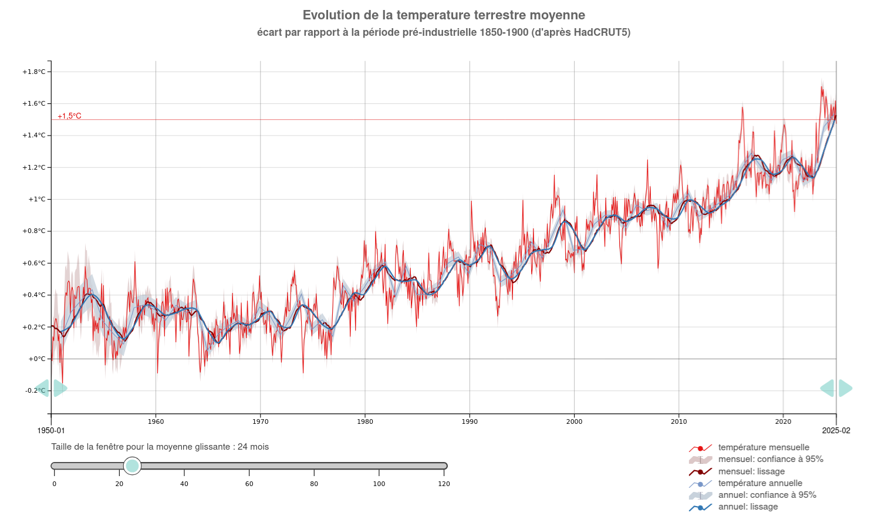
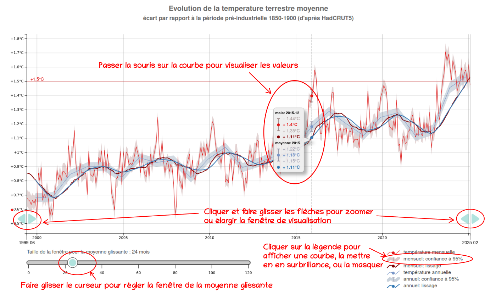
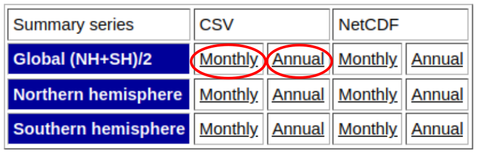

<h1 align="center">Evolution de la température mondiale moyenne .</h1>
<h1 align="center">Graphique interactif</h1>

### Graphique interactif montrant l'évolution de la température mondiale moyenne  :
<ul>
<li>relevés mensuels et intervalle de confiance à 95%</li>
<li>relevés annuels et intervalle de confiance à 95%</li>
<li>moyenne glissante dont la fenêtre est réglable</li>
<li>fonction zoom</li>
</ul>

### Live demo : [ici](https://C-Vellen.github.io/Analyses-Temperatures)

### Mode d'emploi :

 

### Utilisation, personnalisation :
<ol>

<li>Mettre à jour les données :
<ul>
    <li>Lien pour télécharger les données : <a href="https://www.metoffice.gov.uk/hadobs/hadcrut5/">ici</a>, puis cliquer sur DOWNLOAD DATA
    </li>
    <li>
    Fichiers à télécharger :
        

        
        

    </li>
    <li>
    Enregistrer les 2 fichiers téléchargés :
    <ul>
    <li>HadCRUT.5.1.0.0.analysis.summary_series.global.monthly.csv</li>
    <li>HadCRUT.5.1.0.0.analysis.summary_series.global.annual.csv</li>
    </ul>
    dans le dossier <strong>data/</strong>
    </li>
   
</ul>
</li>

<li>Personnaliser les paramètres d'affichage du graphique:
<ul>
    <li>Ouvrir le notebook <strong>preparation_dataset.ipynb</strong> (environnement python 3.12.10, avec librairie pandas).</li>
    <li>Dans la cellule "A documenter", choisir la <strong>version</strong> = référence des évolutions de température (1961-1990 ou pré-industriel)
    </li>
    <li>Vérifier le nom des fichiers <strong>sourceFiles</strong>.
    </li>
     <li>Vérifier l'échelle de temps : variables <strong>dateDebut</strong> et <strong>dateFin</strong>>.
    </li>
    <li>Dans la liste <strong>curveToDisplay</strong> choisir les courbes à afficher en commentant / décommentant. On peut notamment choisir d'afficher la moyenne glissante selon différentes méthodes de calcul (simple, centrée, pondérée, exponentielle).
    </li>
    <li>Dans le dictionnaire <strong>curveToDisplay</strong>, on peut modifier l'apparence des courbes (couleur, épaisseur, légende,...).
    </li>
    <li>Enregistrer et exécuter le notebook <strong>preparation_dataset.ipynb</strong>, ce qui va mettre à jour le fichier <strong>staticfolder/dataset.js</strong>.
    </li>
</ul>

<li>
Ouvrir <strong>index.html</strong> dans un navigateur.
</li>

</ol>

### Sources des données utilisées pour ce graphique : Met Office Hadley Centre observations datasets : [ici](https://www.metoffice.gov.uk/hadobs/hadcrut5/)

### Traitement des données : [notebook](preparation_dataset.ipynb)

### Technologies utilisées : 
html, css, javascript + librairie d3js, python + librairie pandas

